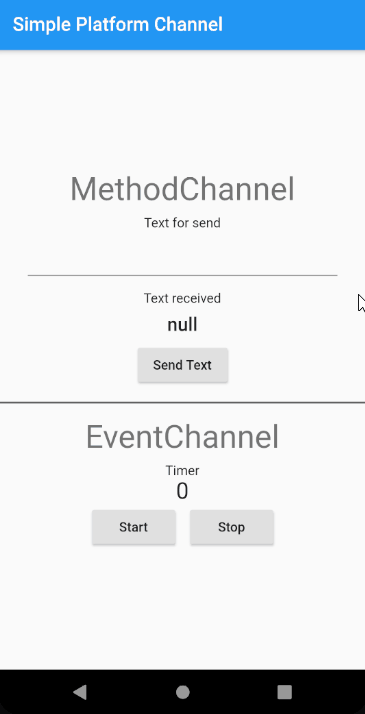
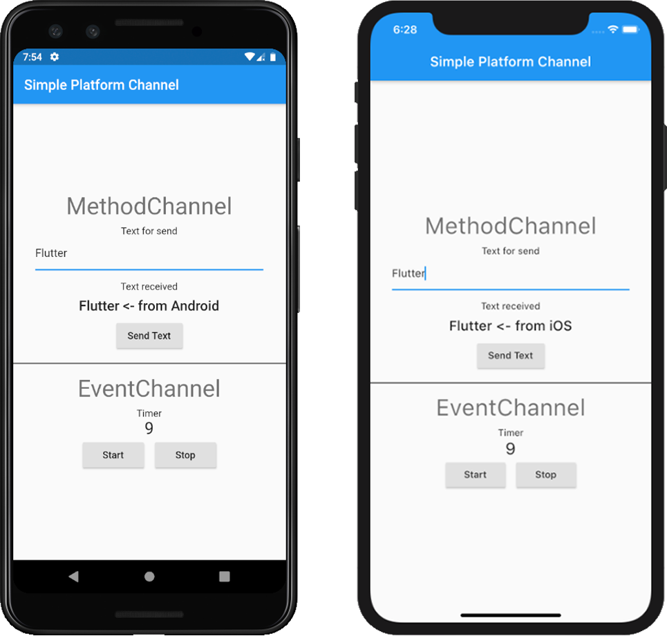

# Flutter Simple Platform Channel

A simple Flutter project implements platform channel. This can be use as a template for MethodChannel on forward between Flutter and Native and EventChannel for Stream event. It is implement on Android Kotlin and iOS Swift. For MethodChannel, it will receive text from Flutter and send back the text with added ending from Native. For EventChannel, it will work as a timer by implement ReactiveX on Native side.

 <p float="left">
  

</p>


## Getting Started

### Clone this project and access it directory

```
git clone https://github.com/Cheersupzoo/flutter_simple_platform_channel.git
cd flutter_simple_platform_channel
```

### Install dependency

```
flutter pub get
```

### Run the app

```
flutter run
```


